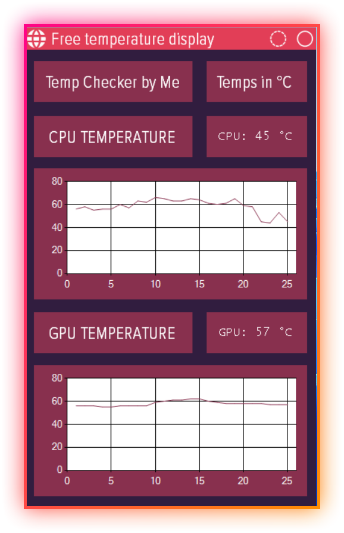

# WindowsForms-TemperatureCheck-GUI

GUI created to display CPU and GPU temperatures using windows forms and .NET framework 4.8

## Features

- Live preview of temperature
- Lightweight
- Stylish

## Screenshots

## Run The Application
To run the application on your computer, you must open the `sln` file on any version of visual studio.
Right click on the `solution` under solution explorer for the project, tap the build solution option and it should generate all the necessary files at the `bin` folder.
