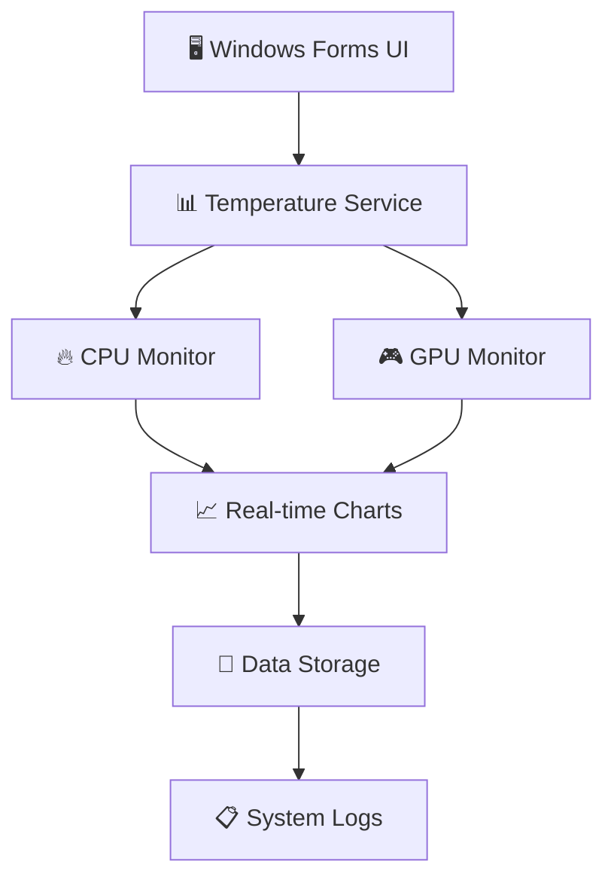

# 🌡️ Windows Temperature Monitor

<div align="center">
  
</div>

<div align="center">
  
  
  
  
  
  
</div>

---

## 📋 Sobre o Projeto

Uma aplicação desktop elegante e eficiente para monitoramento em tempo real das temperaturas de **CPU** e **GPU** do seu sistema Windows. Desenvolvida com Windows Forms e .NET Framework 4.8, oferece uma interface intuitiva e consumo mínimo de recursos.

### 🎯 **Por que usar?**
- ⚡ **Monitoramento em tempo real** das temperaturas do hardware
- 🪶 **Ultra leve** - baixo impacto na performance do sistema
- 🎨 **Interface moderna** e fácil de usar
- 📊 **Visualização gráfica** dinâmica dos dados
- 🔧 **Fácil instalação** e configuração

---

## ✨ Funcionalidades

<table align="center">
  <tr>
    <td align="center">
      <br>
      <strong>Monitoramento Live</strong><br>
      <em>Temperaturas atualizadas em tempo real</em>
    </td>
    <td align="center">
      <br>
      <strong>Ultra Leve</strong><br>
      <em>Consumo mínimo de recursos</em>
    </td>
    <td align="center">
      <br>
      <strong>Interface Elegante</strong><br>
      <em>Design moderno e intuitivo</em>
    </td>
  </tr>
</table>

### 🔥 **Recursos Principais:**

```csharp
// Principais capacidades do sistema
var features = new List<string>
{
    "✅ Monitoramento CPU em tempo real",
    "✅ Monitoramento GPU em tempo real", 
    "✅ Gráficos dinâmicos de temperatura",
    "✅ Interface responsiva Windows Forms",
    "✅ Baixo consumo de memória RAM",
    "✅ Inicialização rápida",
    "✅ Suporte a múltiplas GPUs",
    "✅ Alertas visuais de temperatura"
};
```

---

## 🖼️ Screenshots

<div align="center">
  
  ### 📱 Interface Principal
  
  
  <em>Interface moderna e limpa com visualização em tempo real das temperaturas</em>
  
</div>

---

## 🚀 Como Executar

### 📋 **Pré-requisitos**
- Windows 10/11
- .NET Framework 4.8 ou superior
- Visual Studio 2019+ (para desenvolvimento)

### 🔧 **Instalação e Execução**

1. **Clone o repositório**
   ```bash
   git clone https://github.com/Ansbach-0/WindowsForms-TemperatureCheck-GUI.git
   cd WindowsForms-TemperatureCheck-GUI
   ```

2. **Abra no Visual Studio**
   ```
   📁 Abra o arquivo .sln no Visual Studio
   ```

3. **Build da Solução**
   ```
   🔨 Clique com botão direito na Solution
   ⚙️ Selecione "Build Solution"
   📦 Os arquivos serão gerados na pasta bin/
   ```

4. **Execute a aplicação**
   ```
   ▶️ Navegue até bin/Debug/ ou bin/Release/
   🖱️ Execute o arquivo .exe gerado
   ```

### ⚡ **Execução Rápida**
```bash
# Para desenvolvedores
dotnet build
dotnet run
```

---

## 🛠️ Tecnologias Utilizadas

<div align="center">

| Tecnologia | Versão | Uso |
|------------|--------|-----|
|  | Latest | Linguagem principal |
|  | 4.8 | Framework base |
|  | Integrado | Interface gráfica |
|  | 2019+ | IDE de desenvolvimento |

</div>

---

## 📊 Arquitetura do Sistema



---

## 🎨 Design Patterns Utilizados

- **🏗️ Singleton Pattern** - Gerenciamento de instância única do monitor
- **👀 Observer Pattern** - Atualização em tempo real da interface
- **🏭 Factory Pattern** - Criação de componentes de monitoramento
- **📋 Repository Pattern** - Gerenciamento de dados de temperatura

---

## 🔧 Configuração Avançada

### ⚙️ **Personalização de Alertas**
```xml
<configuration>
  <appSettings>
    <add key="CPUTempThreshold" value="80" />
    <add key="GPUTempThreshold" value="85" />
    <add key="UpdateInterval" value="1000" />
    <add key="EnableAlerts" value="true" />
  </appSettings>
</configuration>
```

### 📈 **Intervalos de Atualização**
- **Padrão:** 1000ms (1 segundo)
- **Performance:** 500ms (0.5 segundos)
- **Economia:** 2000ms (2 segundos)

---

## 🐛 Solução de Problemas

<details>
<summary><strong>❌ Aplicação não inicia</strong></summary>

- Verifique se o .NET Framework 4.8 está instalado
- Execute como administrador
- Verifique se não há antivírus bloqueando
</details>

<details>
<summary><strong>🌡️ Temperaturas não aparecem</strong></summary>

- Verifique se os drivers da GPU estão atualizados
- Execute a aplicação como administrador
- Verifique compatibilidade do hardware
</details>

<details>
<summary><strong>⚡ Performance lenta</strong></summary>

- Aumente o intervalo de atualização
- Feche outras aplicações de monitoramento
- Verifique recursos disponíveis do sistema
</details>

---

## 🤝 Como Contribuir

Contribuições são sempre bem-vindas! Para contribuir:

1. **Fork** o projeto
2. Crie sua **feature branch** (`git checkout -b feature/AmazingFeature`)
3. **Commit** suas mudanças (`git commit -m 'Add some AmazingFeature'`)
4. **Push** para a branch (`git push origin feature/AmazingFeature`)
5. Abra uma **Pull Request**

### 🎯 **Áreas para contribuição:**
- 🆕 Novas funcionalidades
- 🐛 Correção de bugs
- 📚 Melhoria da documentação
- 🎨 Melhorias na interface
- 🔧 Otimizações de performance

---

## 📄 Licença

Este projeto está sob a licença **MIT**. Veja o arquivo [LICENSE](LICENSE) para mais detalhes.

```
MIT License - Livre para uso pessoal e comercial
```

---

## 👨‍💻 Desenvolvedor

<div align="center">
  
  **Vinícius Ansbach Costa**
  
  [](https://linkedin.com/in/vinicius-ansbach)
  [](https://github.com/Ansbach-0)
  [](mailto:ansbach.vinicius@gmail.com)
  
</div>

---

## ⭐ Apoie o Projeto

Se este projeto foi útil para você, considere dar uma ⭐ no repositório!

<div align="center">
  
  **💡 Dica:** Use o botão "Watch" para receber notificações de atualizações!
  
  
  
  
</div>

---

<div align="center">
  
  
  **🌡️ Mantenha seu PC sempre na temperatura ideal! 🌡️**
</div>
